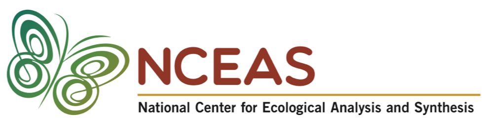

# Welcome!

This webpage contains the collected best practice tips of the NCEAS Scientific Computing Support Team. More will be added over time and feel free to post [an issue](https://github.com/NCEAS/scicomptasks/issues) if you have a specific request for a chapter to add to this document.

Please feel free to reach out to our team (see [here](https://www.nceas.ucsb.edu/programming-support)) if you have any questions about this best practices manual and/or need help implementing some of this content.
