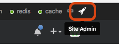

# Adding a New User to NCEAS' GitHub Enterprise (GHE)

**"adding_github_user.py"**

-   Python script for adding a user to NCEAS' GitHub Enterprise. Adapted from [this Stack Overflow post](http://stackoverflow.com/questions/36833231/adding-group-using-python-ldap). \*\*More human-readable instructions below:

    -   1\) Ask user to register following [these steps](https://docs.google.com/document/d/1eoR1oDrCrczgbYHPZU_1szB_2fhzu7EUHnh5nFI3eSg/edit?usp=sharing)
    -   2\) Add the user to the LDAP group. On Aurora:

    ```{bash}
    python adding_github_user.py nceas-github {LDAP username of new user}
    ```

    -   *2B)* Note that you'll need the admin LDAP password handy to run this script.

    -   3\) Add the user to the respective GHE Teams

    -   4\) To let the new user see their repositories you need to force create the user.

    -   *4A)* Click on 

    -   *4B)* Click on *LDAP users* in the left panel

    -   *4C)* Search for the username

    -   *4D)* Click *Create* to activate the dormant user

    -   5\) Add the user to the Organization(s) and Team(s)

    -   *5A)* Click on *Organizations* in the left panel

    -   *5B)* Click on the organization

    -   *5C)* Click on *View profile*

    -   *5D)* Click on the *Teams* tab

    -   *5E)* Select the team

    -   *5F)* Type the username in the *Add person box*
